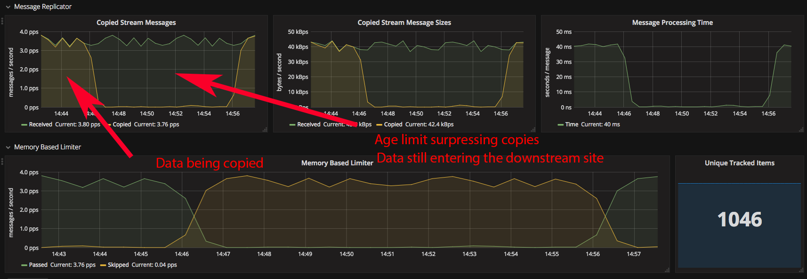

# NATS Streaming Topic Replicator

This is a tool that consumes 1 topic in a NATS Streaming server and replicates it to another NATS Streaming server.

## Features:

  * Order preserving single worker topic replication
  * Vertically and Horizontally scalable worker pools for unordered replication
  * Filtering out high frequency updates of similar data to reduce traffic in a multi site feeding a single global store scenario.
  * Metrics about the performance and throughput are optionally exposed in Prometheus format

When there is only 1 worker in a un-queued setup this will create a Durable subscription in the origin NATS Stream with either a generated name or one you configure.

When there are many workers or it's specified to belong to a queue group a Durable Queue Group is created with either a generated name or ones you specify.

First time it connects it attempts to replicate all messages, as the subscription is Durable it will from then on continue where it left off.

## Status

This is a pretty new project and not yet used in production, use with caution and I'd love any feedback you might have - especially design ideas about multi worker order preserving replication!

Feature wise the only real remaining thing on my initial wishlist is to make the current undocumented SSL configuration be topic specific, but with the ability to have a global configuration.  Apart from that this does what I need.  I've tested it at some scale and it performs really well but not yet running it for more than a few days.

Initial packages for el6 and el7 64bit systems are now on the Choria YUM repository, see below.

## Configuration

A single configuration file can be used to configure multiple instances of the replicator.

You'll run one or more processes per replicated topic but not 1 process for multiple topics - unless you use wildcards.

Configuration is done using a YAML file:

```yaml
debug: false                     # default
verbose: false                   # default
logfile: "/path/to/logfile"      # STDOUT default
state_dir: "/path/to/statedir"   # optional
topics:
    cmdb:
        topic: acme.cmdb
        source_url: nats://source1:4222,nats://source2:4222
        source_cluster_id: dc1
        target_url: nats://target1:4222,nats://target2:4222
        target_cluster_id: dc2
        workers: 10              # optional
        queued: true             # optional
        queue_group: cmdb        # optional
        inspect: host            # optional
        age: 1h                  # optional
        monitor: 10000           # optional
        name: cmdb_replicator    # optional
```

You would then run the replicator with `stream-replicator --config sr.yaml --topic cmdb`

## Replicating a topic, preserving order

The most obvious thing you'd want to do is replicate one topic between clusters and preserve order - not sequence IDs, that's not possible.

Due to how NATS Streaming work it's possible but with a few caveats:

  1. You can only have 1 worker subscribed to the topic
  1. You cannot have this worker belong to any queue group

This means you'll be limited in throughput and it might not work well for very busy streams.  As far as I can tell this is unavoidable, you have to code your apps to be resilient to out of order messages in distributed systems so presumably this is not a huge limiting factor, but if you have to it can be done with a topic config like this:

```yaml
topics:
    cmdb:
        topic: acme.cmdb
        source_url: nats://source1:4222,nats://source2:4222
        source_cluster_id: dc1
        target_url: nats://target1:4222,nats://target2:4222
        target_cluster_id: dc2
        workers: 1
```

You can specify `monitor` and inspect settings but no workers or queue related settings.

The `workers` here is optional but it's handy to set it to 1 specifically to enforce the intent.

NOTE: With a more complex replicator - one that builds its own buffer of messages you could make this scale better but its a significantly more complex piece of software in that case.

## Scaled topic replication

If you have a topic and order does not matter in it - like regular node registration data or metrics perhaps - you can have many workers on one or more machines all sharing the load of replicating the topic.

In that case ordering is not guaranteed but you will get much higher throughput.

```yaml
topics:
    cmdb:
        topic: acme.cmdb
        source_url: nats://source1:4222,nats://source2:4222
        source_cluster_id: dc1
        target_url: nats://target1:4222,nats://target2:4222
        target_cluster_id: dc2
        workers: 10
```

This will automatically create a Queue Group name based on the topic and so all workers will belong to the same group.  If you set up the same configuration on a 2nd node it too will join the same group and so load share the replication duty.

See the notes below about client names and queue group names though if you wish to scale this to multiple nodes.

## Inspecting and limiting replication of duplicated data

I intend to use this with Choria's NATS Stream adapter to build a registration database.  My nodes will publish their metadata regularly but outside of the local network I don't really need it that regular.


```
                   /--------\
                   | stream |
                   \--------/
                 /            \
               /   once / hour  \
             /                    \
      /--------\                /--------\
      | stream |                | stream |   ...... [ x 10s of sites ]
      \--------/                \--------/

  /////||||||||\\\\\        /////||||||||\\\\\
    5 min interval            5 min interval
      node data                  node data
```

In the above scenario I get data from my nodes very frequently and the combined stream would overwhelm my main layer data processors due to the amount of downstream sources.

I will thus have a high frequency processor - and so very fresh data - in every data center but the central one gets a 1 hourly update from all nodes only.

The replicator can facilitate this by inspecting the JSON data in the messages for a specific uniquely identifying field - like a hostname - and only publishing data upward if it has not yet seen that machine in the past hour.

This works well it means new registration data goes up immediately and a regular configurable heartbeat flows through the entire system.  With in-datacenter data being fresh where high throughput automations depend on fresh data.  See the sample graph down by Metrics where one can see the effect of the local traffic vs replicated traffic with a 30 minute setting.

At present the data store for the last-seen data is in memory only so this only works on a single node scenario (but supports many workers), in future perhaps we can support something like `etcd` or `redis` to store that data.

It does however support storing the state every 30 seconds and on shutdown to a file per topic in `state_dir` and it will read these files on startup.  On a large site with 10s of thousands of unique senders this greatly reduce the restart cost, but on a small site it's probably not worth bothering with, unless you really care and things will break if you get more updates per `age` than configured.

```yaml
state_dir: /var/cache/stream-replicator

topics:
    cmdb:
        topic: acme.cmdb
        source_url: nats://source1:4222,nats://source2:4222
        source_cluster_id: dc1
        target_url: nats://target1:4222,nats://target2:4222
        target_cluster_id: dc2
        inspect: sender
        age: 1h
```

## About client and queue group names

By default if you replicate topic `foo.bar` the client name for the replicator will be `foo_bar_stream_replicator_n` where `n` is the number of the worker.

If a group is needed - like when workers is > 1 or `queued` is set the group will be called `foo_bar_stream_replicator_grp`.

This works fine for almost all cases out of the box if you want to scale your workers across multiple machines you might need to set custom names, something like:

```yaml
topics:
    cmdb:
        topic: acme.cmdb
        source_url: nats://source1:4222,nats://source2:4222
        source_cluster_id: dc1
        target_url: nats://target1:4222,nats://target2:4222
        target_cluster_id: dc2
        workers: 10
        name: cmdb_replicatorA
        queue_group: cmdb
```

This will start workers with names `cmdb_replicatorA_0`...`cmdb_replicatorA_9` all belonging to the same queue group.  On another node set `name: cmdb_replicatorB` and so forth.

NOTE: This is likely to change in future releases, right now I don't need multi node scaled replicators so once I do this will be made easier (or file a issue)

## Prometheus Metrics

Stats are exposed as prometheus metrics, some info about what gets exposed below:

In all cases the `name` label is the configured name or generated one as described above, the `worker` label is the unique name per worker.

|Stat|Comments|
|----|--------|
|`stream_replicator_received_msgs`|How many messages were received. The difference between this and `stream_replicator_copied_msgs` is how many limiters skipped|
|`stream_replicator_received_bytes`|The size of messages that were received|
|`stream_replicator_copied_msgs`|A Counter indicating how many messages were copied|
|`stream_replicator_copied_bytes`|A Counter indicating the size of that messages were copied|
|`stream_replicator_failed_msgs`|How many messages failed to copy|
|`stream_replicator_acks_failed`|How many times did sending the ack fail|
|`stream_replicator_processing_time`|How long it takes to do the processing per message including ack'ing it to the source|
|`stream_replicator_connection_reconnections`|How many times did the NATS connection reconnect|
|`stream_replicator_connection_closed`|How many times did the NATS connection close|
|`stream_replicator_connection_errors`|How many times did the NATS connection encounter errors|
|`stream_replicator_current_sequence`|The current sequence per worker, this is kind of not useful in pooled workers since messages are tried in any order, but in a single worker scenario this can help you discover how far behind you are|
|`stream_replicator_limiter_memory_seen`|When inspecting the messages this shows the current size of the known list in the memory limiter - the list is scrubbed every `age` + 10 minutes of within that time.|
|`stream_replicator_limiter_memory_skipped`|Number of times the memory limiter determined a message should be skipped|
|`stream_replicator_limiter_memory_passed`|Number of times the memory limiter allowed a message to be processed|
|`stream_replicator_limiter_memory_errors`|Number of times the processor function returned an error|

A sample Grafana dashboard can be found in [dashboard.json](dashboard.json), it will make a graph along these lines:



## Packages

RPMs are hosted in the Choria yum repository for el6 and 7 64bit systems:

```ini
[choria]
name=Choria Orchestrator - $architecture
baseurl=https://dl.bintray.com/choria/el-yum/el$releasever/$basearch
gpgcheck=0
repo_gpgcheck=0
enabled=1
protect=1
```

On a RHEL7 system the systemd unit files are using templating, if you have a configuration section for `cmdb` you would run that using `systemctl start stream-replicator@cmdb`.

On a RHEL6 system you can edit `/etc/sysconfig/stream-replicator` and set `TOPICS="cmdb monitor"` to start a instance for the configured topics matching the names.